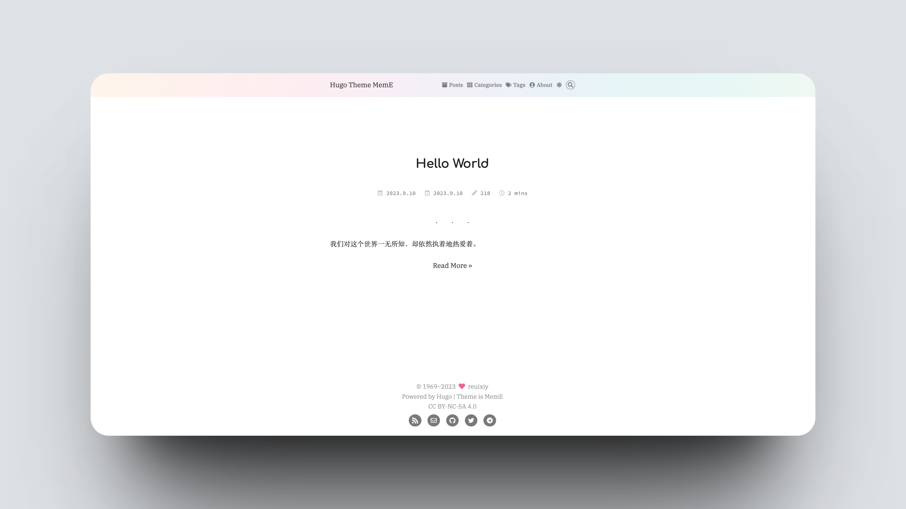
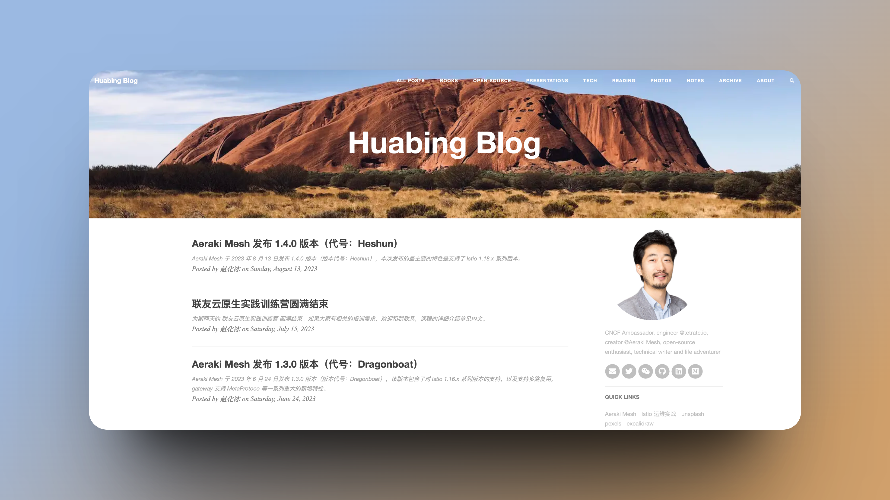
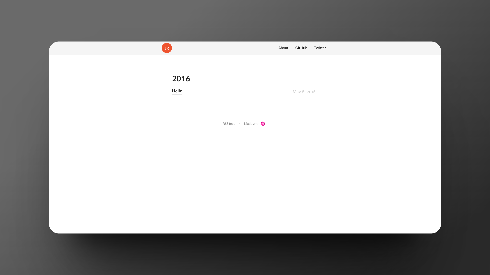
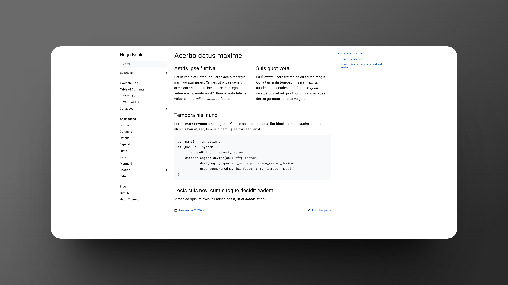

# hugo-theme-demo

 

收集并展示一些开源 Hugo 主题。

## memE

- [项目地址](https://github.com/reuixiy/hugo-theme-meme)
- [官方 Demo](https://io-oi.me/hugo-theme-meme/)
- [CF Pages Demo](https://716602ae.hugo-theme-demo.pages.dev/)

## hugo-theme-cleanwhite

- [项目地址](https://github.com/zhaohuabing/hugo-theme-cleanwhite)
- [官方 Demo](https://www.zhaohuabing.com/)

## hugo-lithium-theme

- [项目地址](https://github.com/jrutheiser/hugo-lithium-theme/)
- [官方 Demo](http://jrutheiser.com/)

## hugo-book

> 适合做文档。

- [项目地址](https://github.com/alex-shpak/hugo-book)
- [官方 Demo](https://hugo-book-demo.netlify.app/)

## DoIt

- [项目地址](https://github.com/HEIGE-PCloud/DoIt)
- [官方 Demo](https://hugodoit.pages.dev/)

类似的还有 [feelit](https://feelit.khusika.dev/zh-cn/theme-documentation-content/)、[fixit](https://fixit.lruihao.cn/)

## License

Distributed under the MIT License. See LICENSE.txt for more information.

